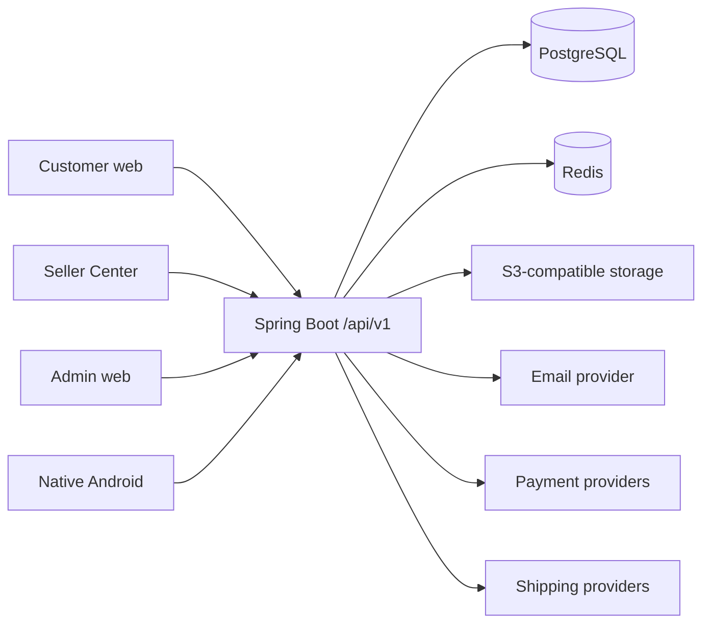

# shoppew architecture

## Decision summary

shoppew starts as a modular monolith with one PostgreSQL database. This keeps checkout, inventory, voucher, payment, order, and finance transactions explicit and testable while the product is still establishing its boundaries. Modules communicate through Java APIs and local domain events, not through direct controller-to-controller calls or an infrastructure broker.

The target repository shape is:

```text
backend/                 Spring Boot modular monolith
web/storefront/          Next.js customer application
web/seller/              Vite React Seller Center
web/admin/               Vite React Admin
web/packages/            shared tokens, UI, types, and API client
mobile/android/          native Kotlin and Jetpack Compose
infrastructure/          deploy and observability assets when required
docs/                    product and engineering contracts
scripts/                 PowerShell developer workflows
```

The modular monolith is deliberate rather than transitional scaffolding. Checkout coordinates pricing, voucher usage, stock reservation, order snapshots, payment context, and seller finance. Keeping those invariants in one process and one authoritative database gives explicit transactions, simpler idempotency, and one deployable while the product and team boundaries are still evolving. Feature packaging still prevents a future distributed monolith: each module owns its controllers, services, repositories, entities, and DTOs.

## System context



PostgreSQL is authoritative. Redis may cache public catalog data, coordinate rate limits, and hold temporary metadata, but cannot be the only record of inventory, voucher usage, orders, payments, or money.

## Backend module boundaries

Code lives under `com.shoppew` and is grouped by business feature:

- `auth`, `user`, `address` own identity, credentials, sessions, and customer profile data.
- `shop`, `seller` own seller membership and shop isolation.
- `category`, `brand`, `product`, `media`, `search`, `recommendation` own catalog discovery.
- `inventory`, `cart`, `checkout`, `order` own the purchase transaction and immutable snapshots.
- `payment`, `shipping`, `voucher`, `promotion` own provider and pricing rules.
- `review`, `wishlist`, `notification`, `chat` own engagement.
- `refund`, `dispute`, `finance`, `admin`, `audit`, `analytics` own marketplace operations.
- `common` contains narrow cross-cutting contracts such as the API envelope, request correlation, clock, and security adapters. It must not become a miscellaneous utility bucket.

Controllers receive client input and delegate to an application service. Application services enforce actor and state rules and define transaction boundaries. Repositories remain inside the owning module. Cross-module reads use explicit services or projections; they do not expose mutable entities as shared contracts.

## API contract

- All product APIs are under `/api/v1`.
- Success and error bodies use one stable envelope.
- Pagination exposes `content`, `page`, `size`, `totalElements`, and `totalPages`.
- JPA entities never cross the controller boundary.
- OpenAPI generated by the backend is the contract source. `@shoppew/api-client` is generated from it; Android currently keeps explicit Retrofit DTOs and verifies changes through compile, parsing/repository tests, and real-device flows rather than a second hand-authored server contract.
- Mutating retries use `Idempotency-Key` where duplicate execution would be harmful.

The clients never infer authorization from a route or hidden control. Web and Android send the current credential; backend services derive user/role/shop membership from that identity and re-check ownership for each referenced object.

## Authentication direction

Web and Android use short-lived access tokens and revocable, rotated refresh sessions. The refresh secret is stored only as a hash on the server. Browsers use a protected HttpOnly refresh cookie plus an in-memory access token; Android encrypts its refresh cookie under an Android Keystore key and keeps the access token in memory. Cookie-mutating authentication endpoints validate the configured Origin and Fetch Metadata boundary. Client return paths accept only strict same-origin absolute paths; scheme-relative, backslash, control-character, and explicitly schemed values are rejected.

## Events

Local Spring domain events decouple secondary work such as notifications, email delivery, media cleanup, and finance reactions from the initiating service. Critical state and audit effects remain in the owning database transaction. Secondary listeners that must observe committed state run after commit.

There is no Kafka/RabbitMQ requirement and no durable outbox implementation today. The current after-commit event path is appropriate for local adapters and effects whose status is persisted transparently, but it does not make an external send survive a process crash between commit and dispatch. Introduce a transactional outbox plus idempotent consumer before any external notification/payment integration requires guaranteed asynchronous delivery.

## Frontend architecture

- Storefront uses Next.js App Router for public/customer routes, server rendering where useful for discovery, client components for authenticated mutations, and TanStack Query for server state.
- Seller Center and Admin are Vite React single-page applications with React Router and protected route shells. Shop selection is contextual UI state; backend membership remains authoritative.
- Each client owns its API/session provider. Access credentials remain in memory and refresh uses the backend HttpOnly cookie; no local-storage token is shared across applications.
- `web/packages/api-client` owns the generated TypeScript schema. `web/packages/ui` owns narrow shared tokens/primitives. Product/business rules stay on the backend rather than in shared UI packages.
- All three clients render real loading, empty, error, pending, validation, and success states for important workflows. The repository design system defines cross-client visual behavior without copying another marketplace.

## Android architecture

The native client separates Compose screens/presentation state, repository/domain operations, Retrofit/OkHttp transport, and Room read caching. Hilt provides dependencies; ViewModels expose StateFlow to Compose. Catalog/category reads may fall back to Room, but cart, account, checkout, order, payment, and other mutations are never silently queued while offline.

An OkHttp authenticator serializes one refresh attempt, secure storage encrypts the rotating refresh cookie with an Android Keystore key, and release builds disallow cleartext networking. Android registers its Firebase Installation ID after authenticated session establishment and revokes it before logout; the backend encrypts the target, sends through a conditional Firebase Admin adapter, and persists bounded retries. Firebase project credentials and a current physical-device delivery test remain external release gates. Android device verification uses a USB-connected physical phone, not an emulator.

## Future extraction strategy

Extraction is an operational decision, not a phase-completion checkbox. A candidate must have a stable internal contract, independent data ownership, measurable scaling/isolation need, an idempotent event/API boundary, an observability/on-call owner, and a tested failure mode. Until then it remains a feature module in the monolith.

| Candidate | Evidence that could justify extraction | Boundary required first |
| --- | --- | --- |
| Search | Query traffic/index scaling diverges materially from transactional catalog | Durable catalog-change feed, rebuildable index, stale-read policy |
| Chat | Connection/message volume needs independent scaling or availability | Conversation authorization service, ordered/idempotent message contract |
| Notification | Provider retries/throughput require independent workers | Transactional outbox, delivery idempotency, preference/device lifecycle |
| Payment | Compliance/network isolation or provider blast radius demands separation | Signed idempotent commands/callbacks, immutable payment-event contract |
| Recommendation | Independent compute/storage and experimentation cadence | Versioned feature/event inputs, deterministic fallback owned by catalog |

Do not extract these modules merely because they are listed. A distributed transaction across inventory, checkout, order, payment, and finance would be a regression without a proven need and a designed consistency model.

## Deployment direction

Docker Compose is the local baseline. A production deployment can run the modular monolith as stateless replicas behind a proxy with managed PostgreSQL, Redis, S3-compatible storage, and provider credentials. Kubernetes is not a project requirement. See [DEPLOYMENT.md](DEPLOYMENT.md) for the current artifacts, fail-fast production configuration, external-provider gaps, and rollout checklist.
