# shoppew database

## Principles

- PostgreSQL is the source of truth.
- Flyway owns schema history; production Hibernate mode is `validate`.
- Public business identifiers use UUIDs.
- Money uses `NUMERIC(19,2)` with an explicit ISO currency code.
- Timestamps use `TIMESTAMPTZ` and are stored consistently in UTC.
- Mutable inventory and balances carry version columns; critical commands still use explicit atomic updates/locks and transactions.
- Order-item, payout-destination, and audit data preserve historical snapshots rather than joining only to mutable catalog/profile data.

## Migration ownership

| Migration | Scope |
| --- | --- |
| `V1__identity_catalog_inventory.sql` | users, roles, sessions, addresses, shops, catalog, variants, media metadata, inventory and reservations |
| `V2__commerce.sql` | cart, checkout groups, seller orders, immutable items, payments, shipping, vouchers, promotions, idempotency |
| `V3__engagement_operations.sql` | wishlist, reviews, notifications, chat, refunds, disputes, seller ledger, payouts, audit and analytics events |
| `V4__identity_completion.sql` | one-time authentication action tokens and per-shop commerce settings |
| `V5__catalog_moderation.sql` | product moderation notes and moderation queue indexes |
| `V6__inventory_cart_hardening.sql` | inventory backfill for existing variants, cart variant/product/shop composite integrity, cart quantity limit, and inventory query indexes |
| `V7__checkout_order_payment.sql` | payload-bound checkout idempotency, one reservation per order/variant, and the active mock shipping method seed |
| `V8__voucher_promotion_hardening.sql` | checkout-bound voucher usage plus reserved/consumed/released promotion usage and query indexes |
| `V9__refund_finance_hardening.sql` | previous-order-state and item/seller-charge refund snapshots, payout idempotency, and refund/audit lookup indexes |
| `V10__search_recommendations.sql` | PostgreSQL full-text GIN search index plus per-user durable product views and recency/popularity indexes |
| `V11__search_performance.sql` | `pg_trgm`, trigram GIN product-name search/suggestion acceleration, and a partial active-variant product/price index |

## Major relationships

```mermaid
erDiagram
    APP_USERS ||--o{ USER_ROLES : has
    APP_USERS ||--o{ USER_SESSIONS : owns
    APP_USERS ||--o{ USER_ADDRESSES : owns
    APP_USERS ||--o{ SHOPS : owns
    SHOPS ||--o{ SHOP_MEMBERS : grants
    SHOPS ||--o{ PRODUCTS : sells
    CATEGORIES ||--o{ CATEGORIES : contains
    CATEGORIES ||--o{ PRODUCTS : classifies
    PRODUCTS ||--o{ PRODUCT_VARIANTS : offers
    PRODUCT_VARIANTS ||--|| INVENTORIES : tracks
    PRODUCT_VARIANTS ||--o{ INVENTORY_RESERVATIONS : reserves
    APP_USERS ||--o| CARTS : owns
    CARTS ||--o{ CART_ITEMS : contains
    APP_USERS ||--o{ CHECKOUT_GROUPS : creates
    CHECKOUT_GROUPS ||--o{ ORDERS : splits
    SHOPS ||--o{ ORDERS : fulfills
    ORDERS ||--o{ ORDER_ITEMS : snapshots
    APP_USERS ||--o{ WISHLISTS : saves
    PRODUCTS ||--o{ WISHLISTS : appears_in
    APP_USERS ||--o{ PRODUCT_VIEWS : records
    PRODUCTS ||--o{ PRODUCT_VIEWS : receives
    CHECKOUT_GROUPS ||--|| PAYMENTS : pays
    PAYMENTS ||--o{ PAYMENT_EVENTS : deduplicates
    ORDERS ||--o| SHIPMENTS : ships
    ORDERS ||--o{ ORDER_STATUS_HISTORY : records
    ORDERS ||--o{ VOUCHER_USAGES : applies
    VOUCHERS ||--o{ VOUCHER_USAGES : reserves
    PROMOTIONS ||--o{ PROMOTION_PRODUCTS : targets
    PROMOTION_PRODUCTS ||--o{ PROMOTION_USAGES : reserves
    ORDER_ITEMS ||--o| REVIEWS : proves
    PRODUCTS ||--o{ REVIEWS : receives
    APP_USERS ||--o{ NOTIFICATIONS : receives
    NOTIFICATIONS ||--o{ NOTIFICATION_DELIVERIES : records
    APP_USERS ||--o{ CONVERSATIONS : starts
    CONVERSATIONS ||--o{ MESSAGES : contains
    ORDERS ||--o{ REFUND_REQUESTS : disputes
    REFUND_REQUESTS ||--o{ REFUND_REQUEST_ITEMS : snapshots
    REFUND_REQUESTS ||--o| REFUNDS : executes
    ORDERS ||--o{ DISPUTES : escalates
    DISPUTES ||--o{ DISPUTE_MESSAGES : contains
    SHOPS ||--|| SELLER_BALANCES : owns
    SHOPS ||--o{ SELLER_TRANSACTIONS : records
    APP_USERS o|--o{ AUDIT_LOGS : acts
```

## Inventory model

Each sellable `product_variant` has one `inventory` aggregate with available, reserved, sold, low-stock threshold, and optimistic version fields. `inventory_reservations` tie a quantity to an order/variant and carry an explicit active/consumed/released/expired lifecycle. `inventory_transactions` are the immutable movement ledger used to explain adjustments, reservations, releases, and sales.

Cart rows never reserve stock. Checkout locks/updates the authoritative aggregate and inserts the order-linked reservation in one transaction. A unique order/variant constraint makes retry effects observable and prevents duplicate reservations; quantities also have non-negative checks. Expiration scans are bounded and terminal reservation states make release/consume idempotent.

## Order and payment model

One customer checkout creates a `checkout_group`, then one `order` per shop. Each order stores an `order_address`, `order_items` with immutable product/variant/SKU/image/price/discount snapshots, and append-only `order_status_history`. Later product edits or address changes therefore cannot rewrite purchase history.

The checkout group owns the payment context. `payments` store provider, external reference, amount/currency and state; `payment_events` deduplicate authenticated provider callbacks by external identity/payload. A shipment and its tracking timeline belong to the seller order. Voucher and promotion usage rows are reserved/consumed/released alongside checkout/order state so usage limits cannot be enforced only in memory.

## Finance, refunds, and operations model

`seller_transactions` are append-only money movements with unique business reference keys. `seller_balances` are locked aggregates split into pending and available amounts; they accelerate reads but do not replace the ledger. Delivery records the snapshotted gross/discount/platform-fee effects, completion releases seller net, and refund processing deducts the stored seller charge exactly once.

Refund requests snapshot item quantities and server-calculated customer/seller amounts. A processed refund, order/payment partial-refund state, seller ledger effect, and admin audit record share deliberate transaction/idempotency boundaries. Disputes retain their participant messages and resolution state. `audit_logs` capture critical actor/action/resource/request metadata; analytics read persisted commerce/operation state rather than trusting client counters.

## Critical transaction boundaries

### Inventory reservation

Reserve with an atomic conditional update or a row lock on `inventories`: decrement `available_quantity`, increment `reserved_quantity`, insert the reservation, and append an inventory transaction in one database transaction. The update succeeds only when available stock is sufficient. Expiry changes the reservation and inventory exactly once.

### Multi-shop checkout

Revalidate every selected item, address, seller, price, promotion, voucher, shipment, and payment choice on the server. Create one checkout group, one seller-owned order per shop, immutable order items, inventory reservations, voucher reservations, and a payment context in a deliberate transaction. External provider calls occur through a recoverable boundary rather than holding database locks.

### Payment confirmation

Deduplicate provider callbacks by provider/event ID and payload hash. Lock the payment/checkout state, apply a valid transition once, consume inventory reservations once, and create seller ledger entries with unique reference keys.

### Seller finance

Historical money movement is append-only in `seller_transactions`; `seller_balances` is a locked aggregate for fast reads. Each business effect has a unique reference key so retries cannot duplicate fees, sales, refunds, or payouts.

Delivery posts gross merchandise, seller-funded discount, and configured platform-fee snapshots into pending balance. Customer completion releases the snapshotted seller net to available balance. Refund rows store both the customer amount and the seller charge; processing deducts the stored seller charge once and never recalculates it from mutable catalog data.

## Important constraints and indexes

- Case-insensitive email and voucher code uniqueness use `citext`.
- One active default customer address is enforced with a partial unique index.
- Shop SKU is unique across the shop.
- Available, reserved, sold, discount, and monetary quantities cannot be negative.
- One review is allowed per order item, tying eligibility to a purchase.
- One wishlist row is allowed per user/product pair, and one delivery row per notification/channel pair.
- Refresh token hashes, webhook event IDs, checkout keys, refund keys, and finance references are unique.
- Catalog search has an immediate PostgreSQL full-text index; an optional search adapter may be introduced later.
- Case-insensitive name suggestion/search is accelerated by the V11 `pg_trgm` GIN index. Active variant price access uses a partial `(product_id, price)` index; PostgreSQL still remains the catalog authority.
- User, shop, order, notification, chat, refund, finance, and audit timelines have targeted compound indexes.

Before applying V11 in a managed production database, confirm that the migration role may create `pg_trgm` or ask an authorized DBA to pre-install the extension. Flyway migrations are append-only; never edit an already applied file.

Category-cycle prevention and actor ownership require service-level validation in addition to the direct self-reference check. Database constraints are a last line of defense, not a substitute for explicit business errors.
