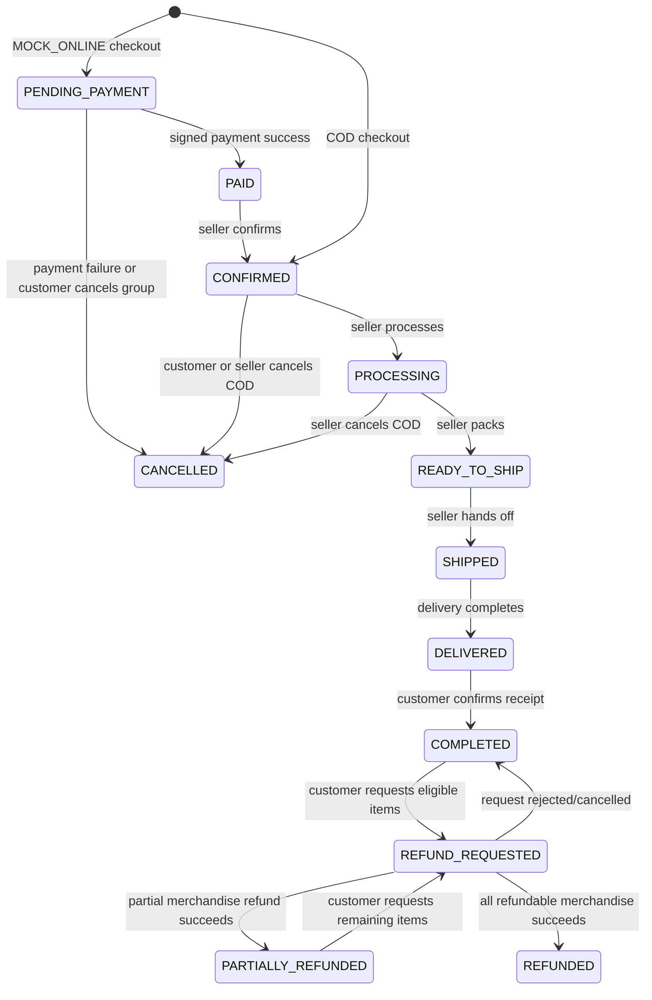

# Order flow

## Aggregate boundary

A checkout group belongs to one customer and represents a single payment decision. Checkout creates one order per shop so sellers can fulfill independently. Each order stores immutable product, variant, SKU, option, unit-price, address, customer-note, and monetary snapshots; later catalog/profile edits cannot rewrite purchase history.

Inventory is reserved transactionally while checkout is placed. COD consumes the reservation immediately because the order is confirmed for fulfillment. `MOCK_ONLINE` keeps the reservation while payment is pending and consumes or releases it exactly once when the provider event succeeds or fails.

## Explicit transitions

There is no generic status-patch endpoint. Every command locks the order, validates the current state and actor scope, writes `order_status_history`, and publishes an `OrderStatusChangedEvent`.

Refund states are reachable only through the authorized refund workflow. Rejection or customer cancellation restores the exact previous refundable order state; processing uses a separate idempotency key and writes order history/domain events like every fulfillment command.

## Shipping

Shipping is provider-based. `MOCK_STANDARD` currently produces deterministic server-side quotes and estimated dates. Checkout stores the selected method and quote in a shipment. Ready, ship, and deliver commands update shipment state and append tracking records; the ship command may attach a tracking number and location.

## Authorization and retry rules

- Customers can read only their own orders and payments.
- Sellers must be active members of the order's exact shop; cross-shop IDs return the same not-found boundary.
- The checkout key is scoped to the customer and bound to a normalized request hash.
- Retrying an identical checkout returns the original group and orders without reserving stock twice.
- Cancelling a pending online checkout applies to every order in that checkout group so payment and reservations cannot split-brain.
