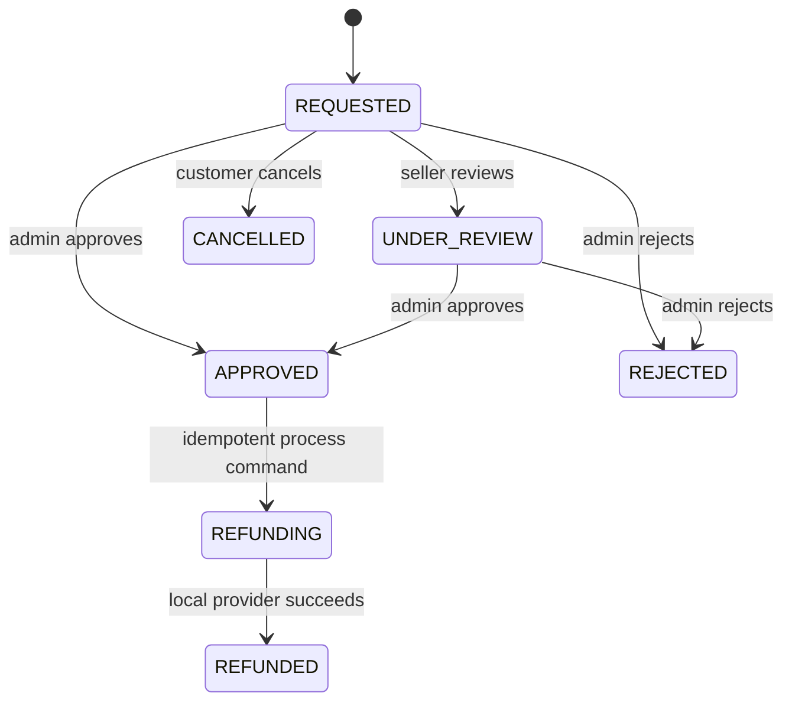

# Refund, dispute, finance, audit, and analytics flow

## Refund pricing and lifecycle

A customer submits an owned order ID plus immutable order-item IDs, quantities, a reason, and optional description. The server requires a `COMPLETED` or `PARTIALLY_REFUNDED` order inside the shop return window. It rejects foreign items, repeated item IDs, and quantities already allocated to non-cancelled refund requests.

The customer refund amount is prorated from the order's snapshotted merchandise subtotal after shop and platform discounts. The seller-charge amount is independently prorated after the seller-funded discount. Both amounts are stored per refund item by Flyway V9, so later product price, voucher, fee, or catalog changes cannot rewrite history.

Admin processing requires an `Idempotency-Key`. A key is globally unique and bound to one refund request. A replay returns the stored refund. Creation of the refund row, request/order/payment state updates, seller balance deduction, ledger append, and audit record share the transaction; any failure rolls the operation back.

The local development provider succeeds synchronously and emits a `LOCAL-REFUND-*` reference. It is an explicit adapter boundary, not a fake UI-only action. A remote provider can later replace the execution step while retaining the persisted lifecycle and callback idempotency contract.

## Seller settlement ledger

The local default `APP_PLATFORM_FEE_RATE` is `0.05` and may be changed by environment. At delivery the backend creates unique-reference pending entries for gross merchandise, seller-funded discount, and platform fee. At customer completion it transfers the snapshotted seller net from pending to available. Shipping and platform-funded discounts do not silently reduce seller merchandise proceeds.

`seller_transactions` is append-only; `seller_balances` is a locked aggregate. Refund processing appends one negative `REFUND` entry and deducts the stored seller charge from available, then pending, with any uncovered amount represented as held exposure. Transaction reference uniqueness prevents duplicate settlement or refund effects under retries.

## Dispute authorization

Customers may open a dispute only for an eligible owned order and an optional refund request on that same order. Customer reads/messages are scoped by order owner. Seller reads/messages require active membership in the exact order shop. Admin roles may inspect all timelines, reply, assign themselves, and move the dispute to review/waiting/resolved/closed states; resolution text is mandatory for a terminal decision.

## Audit and analytics

Admin audit rows are append-only and capture action/resource, actor when the authenticated subject is a persisted UUID, serialized before/after state where available, request ID, remote IP, user agent, and timestamp. Current integrations cover category, product/attribute, shop, review, refund, and dispute decisions.

Seller analytics derive revenue from the ledger and orders/top products/low stock from current authoritative tables. Admin analytics derive GMV-like net value, completed orders, new users, active shops, pending moderation, and successful refund volume. Optional ranges must be positive and at most 366 days; no chart needs seeded or fabricated values.
